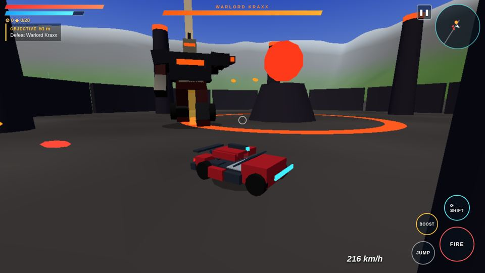

# IRONSHIFT: Rise of the Shiftborn

An open-source, open-world **transforming-robot** action game for Android, built with three.js and shipped as a tiny (~200 KB) APK.

Shift between a towering battle mech and a road-burning car at any moment. Explore a 2 km × 2 km world, fight the Kraxx Legion, and uncover who you were before you woke up in a scrapyard.



## Features

- **Instant transform**: mech mode (blaster, jump, melee-range brawling) ↔ vehicle mode (boost, ramming, speed). Fully animated procedural rig.
- **Open world**: Scrapyard 9, the city of Haven, Rustveil Canyon, the Relay Spire, the Foundry, forests and ruins, with a full day/night cycle.
- **Story campaign**: 5 chapters, voiced-style dialogue, a wave defense, a relay hold, a canyon race and a final boss, Warlord Kraxx.
- **Side content**: 20 Spark Shards, enemy camps, time-trial races and garage upgrades (blaster, armor, engine, boost).
- **Mobile first**: twin-stick touch controls, landscape fullscreen, auto quality settings and autosave. Keyboard + mouse also work in a browser.
- **Zero dependencies at runtime**: everything is bundled into one offline HTML file inside a WebView.

## Play

Grab the APK from [Releases](../../releases), allow installs from unknown sources, and play in landscape.

Or run it in a desktop browser:

```bash
python3 build.py        # fetches three.js r158 once, writes dist/index.html
open dist/index.html    # or serve it with any static server
```

Desktop controls: `WASD` move, mouse look, click fire, `Space` jump, `Shift` boost, `Q` transform, `E` interact, `M` map, `Esc` pause.

## Build the APK

Requires JDK 17+ and the Android SDK (`build-tools;34.0.0`, `platforms;android-34`). No Gradle needed.

```bash
python3 build.py
ANDROID_SDK=$HOME/Android/Sdk bash android/build_apk.sh
# -> android/out/IRONSHIFT.apk
```

The script creates a local debug keystore (`android/ks.jks`) on first run. Set `KS_PASS` to use your own password. Keystores are git-ignored, never commit them.

## Project layout

| Path | What it does |
| --- | --- |
| `src/core.js` | Input (touch + keyboard), audio synth, seeded noise |
| `src/world.js` | Terrain, roads, regions, props, sky and day/night |
| `src/robot.js` | Transforming robot rig and animation |
| `src/entities.js` | Player, enemies, boss, projectiles, pickups, FX |
| `src/story.js` | Campaign steps, dialogue, shards, races, garage |
| `src/ui.js` | HUD, minimap, map, dialogue, shop, touch controls |
| `src/game.js` | Main loop, camera, save/load, quality |
| `android/` | Minimal WebView wrapper and a Gradle-free build script |
| `tests/` | Puppeteer smoke tests that play through the campaign |

## Tests

```bash
npm i puppeteer-core
python3 build.py
CHROME_PATH=/usr/bin/chromium node tests/campaign-smoke.test.js
```

## Contributing

PRs welcome: new regions, enemy types, missions, better models, performance work. Open an issue first for big changes.

IRONSHIFT is an original IP. It is not affiliated with or endorsed by Hasbro or the Transformers franchise.

## License

[MIT](LICENSE) © 2026 Agrim Sharma / REX-codebase
